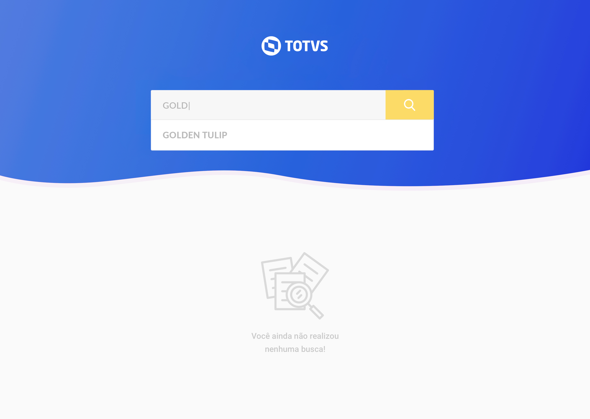

# Desafio Frontend Totvs 2019

**Parabéns!**  
Ficamos muito felizes por você ter chegado até aqui e agora chegou a hora de botar as mãos no código e mostrar toda a sua habilidade.
Nessa etapa queremos ver como você pensa e estrutura seu código, por isso se liga no que vamos desenvolver.

## O desafio
Nosso desafio contempla um simples filtro que exibe seu resultado na forma de cards.  
Cada card, abre e fecha quando o usuário clica no link “ver mais detalhes”. (toggle)  
Caso o usuário clique no botão “ver mais” dentro de um dos cards, uma modal será aberta. 
Essa modal, não precisa fazer nada, deve apenas ter duas opções, "sim" e "não" e ao serem clicados a modal simplesmente fecha.  

Abaixo, segue algumas imagens para te mostrar como pensamos que o filtro poderia ser.

### Imagens

## Regras
* Utilizar o Angular mais recente
* O carregamento das informações deve ser feito via http - (pode ser mocado mesmo, sem problemas)
* Utilizar RxJS
* Aplicar algum tipo de gerênciamento de estados
* Criar testes unitários

## O que será avaliado
* Estrutura e organização do código
* Qualidade do código e poder de reutilização
* Componentização
* Boas práticas e padrões utilizados
* Testes unitários
* Libs utilizadas
* Resultado geral da página

## Dicas
* Tente não fazer tudo em um mesmo commit
* Responsividade é muito importante
* Assim que terminar, mande um email avisando e não faça mais commits depois disso
* No nosso exemplo fizemos uma busca de hotéis, porém você pode usar o buscador para outros temas. Fique a vontade.
* Os dados podem ser mockados ou pode ser utilizado uma API pública de sua preferência para exibir os dados que quiser, pois utilizando endpoints fica bem mais legal, não é mesmo?!
* Criar o projeto do zero
 
 

**Boa sorte! Estamos ansiosos pra ter você na equipe.**

